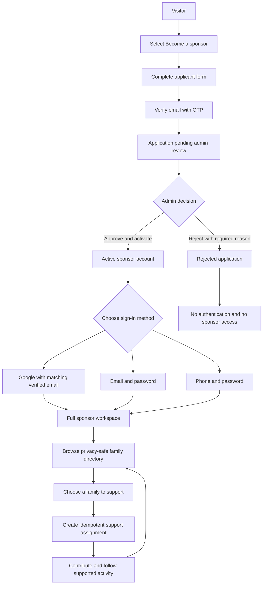

# Applicant Approval and Sponsor Workspace Plan

Status: **PROPOSED — documentation only**

Roadmap relationship: this is a standalone implementation plan in the repository
root. It does not change the current status of [`docs/PLAN.md`](docs/PLAN.md) or
authorize implementation by itself. When implementation starts, synchronize the
accepted slices and evidence back into the authoritative roadmap.

## 1. Outcome

Give Kafil one simple sponsor journey:

1. A visitor sees one public action: **Become a sponsor**.
2. The visitor completes the applicant form and verifies their email.
3. The application waits for manual admin review.
4. An admin approves and activates the sponsor, or rejects with a required
   reason.
5. An approved sponsor signs in using any enabled credential for the same
   account:
   - Google with the exact verified email;
   - email and password; or
   - normalized phone and the same password.
6. The sponsor receives the full sponsor dashboard and sidebar.
7. Inside the authenticated workspace, the sponsor browses the privacy-safe
   family directory and chooses one or more families to support.
8. Cross-role resources use one canonical route and one shared page. Role
   guards change authorized controls and data scope inside the shared HTML; they
   do not select duplicate page components.

Public browsing does not remember a family, create a bookmark, carry a family
identifier into registration, or create a support assignment.

## 2. Target flow



## 3. Non-negotiable product rules

- The public family and landing surfaces have one sponsor CTA: **Become a
  sponsor**.
- The CTA always opens the same applicant form. It carries no family ID,
  bookmark, return-to-family value, local-storage state, cookie state, or hidden
  support intent.
- Registration creates an applicant, not an active sponsor session.
- Email OTP proves control of the email only. It never activates the account.
- Only an explicit admin command may approve and activate a public sponsor.
- Approval does not create a support assignment.
- Rejection requires a reason and creates no sponsor access or assignment.
- Google OAuth may link or authenticate only an already approved account whose
  email exactly matches the provider's verified email. OAuth signup remains
  disabled.
- Email/password and phone/password identify the same account and use the same
  password. Phone values use Kafil's existing Moroccan normalization.
- Active sponsors may support multiple families by selecting them separately
  in the authenticated family directory. No bookmark feature is required.
- Support assignments remain the privacy boundary for sponsor-family linkage.
- Sponsor-facing family data remains aggregated and privacy-safe. Never expose
  guardian identity, CIN, address, documents, internal notes, child identity,
  or raw household identity.
- Authorization is enforced by backend guards. Route hiding and sidebar state
  are presentation only.
- A canonical shared page must not use a role `switch` to return separate
  admin/operator/family/sponsor page components when the underlying layout is
  the same.
- Semantic HTML guards control role-specific sections inside the shared page.
  They do not replace backend authorization or identity scoping.
- Management inheritance and self-service identity are different concepts:
  admin may inherit operator management presentation, but admin must not become
  a family or sponsor identity for `/me` APIs.

## 4. Lifecycle and state model

Keep account state separate from application-review state.

### Application state

```text
pending_email_verification
    -> pending_review
        -> approved
        -> rejected
```

### Auth account state

| Application state | User status | May authenticate? | Sponsor workspace? |
| --- | --- | --- | --- |
| `pending_email_verification` | `pending` | No | No |
| `pending_review` | `pending` | No | No |
| `approved` | `active` | Yes | Yes |
| `rejected` | `inactive` | No | No |

`emailVerified` is evidence about the email address; it is not the sponsor
approval flag.

### Repeated applications

- Match email addresses case-insensitively and phones after normalization.
- An unverified pending application reuses the existing account and resends the
  bounded OTP challenge.
- A verified application awaiting review returns the pending-review outcome
  without creating a duplicate.
- An approved account is directed to sign in.
- A rejected applicant cannot create duplicate applications. A future reopen
  action must be an explicit admin workflow with its own audit event.
- Public responses remain generic enough to avoid account enumeration.

## 5. Applicant creation plan

The frontend and backend work that creates an applicant, collects the
complete profile, verifies email with OTP, handles duplicate submissions, and
ends in `pending_review` is now owned by
[`docs/plans/APPLICANT-CREATION.md`](docs/plans/APPLICANT-CREATION.md).

This workflow resumes at admin review. Applicant creation must still preserve
the lifecycle and product rules above; the separate plan is the source of truth
for its implementation slices, API details, tests, and verification evidence.

## 7. Admin review

Use a canonical admin-only `/applicants` page owned by the dedicated
`Applicants` frontend feature. Applicants are a separate pre-approval entity;
do not place their queue inside `SponsorsPage`, `/operator/sponsors`, or generic
user management.

`ApplicantsPage` owns the applicant header, table/card structure, filters,
review dialog, and responsive behavior:

| Surface | Admin | Operator | Sponsor/Family |
| --- | --- | --- | --- |
| Applicant queue | Yes | No | No |
| Pending/rejected filters | Yes | No | No |
| Approve/reject actions | Yes | No | No |
| Applicant details | Yes | No | No |

Add **Applicants** beneath the existing **People** sidebar group. Render this
item, including its pending-count badge, only for the exact `admin` role. Do not
render it for operators through inherited management presentation. The other
People items keep their existing visibility.

Use URL-backed filter state when navigation history matters:

```text
/applicants                       pending-review applicants
/applicants?status=rejected       rejected applicants
```

`/sponsors` remains the approved-sponsor management page. It must not render
applicant records or applicant decision controls.

### Queue

The queue needs:

- pending-review applicants by default;
- applicant name, email, phone, submission date, and verification state;
- search by name, normalized phone, or email;
- status filtering; and
- a review/details action.

The review surface may show the applicant's private sponsor fields because it is
admin-authorized. Those fields must not leak into sponsor, family, audit-outbox,
or public projections.

### Approve and activate

Expose one explicit `approveAndActivate(applicantId)` command guarded by the
admin role and sponsor-update permission.

In one retryable transaction it must:

1. lock and re-read the application;
2. require `pending_review` and a verified email;
3. require a complete applicant record;
4. assign the sponsor role and change the auth user from `pending` to `active`;
5. create the sponsor profile from the locked applicant and change the
   applicant to `approved`;
6. record reviewer and review timestamp; and
7. append `applicant.approved` to the audit log.

It must not create any support assignment.

After commit, enqueue the approval notification through the outbox. Notification
delivery failure must not roll back or undo approval.

### Reject

Expose one explicit `reject(applicantId, reason)` command guarded by the same
admin authorization. The reason is required, trimmed, and length-bounded.

In one retryable transaction it must:

1. lock and re-read the application;
2. require a reviewable state;
3. set the applicant to `rejected` with reviewer, timestamp, and reason;
4. set the auth user to `inactive`;
5. revoke setup sessions, refresh tokens, and access tokens;
6. consume or revoke outstanding verification challenges; and
7. append `applicant.rejected` to the audit log without copying
   sensitive profile fields.

After commit, enqueue a rejection notification. Rejected applicants receive no
support assignment and no sponsor session.

Concurrent approval/rejection attempts must have one winner. Later attempts
return the existing terminal state without duplicating audit or notification
effects.

## 8. Authentication after approval

All successful authentication paths must converge on the same active sponsor
user and the same session policy.

### Google

- Keep Google signup disabled.
- Require a provider-verified email.
- Auto-link only when the verified Google email exactly matches the approved
  Kafil account email.
- Never activate a pending or rejected application from an OAuth callback.
- Reject unknown, pending, rejected, mismatched, or unverified Google identities.

### Email and password

- Normalize the email case-insensitively.
- Authenticate only an active approved sponsor.
- A correct password for `pending_review` returns an application-pending outcome
  without issuing tokens.
- A rejected or inactive account receives the normal generic access-denied
  response.

### Phone and password

- Normalize separators and Moroccan local/international formats through the
  existing shared phone helper.
- Resolve the same auth user used by email login.
- Apply the same active-and-approved gate before session creation.
- Phone login does not imply phone verification unless Kafil later adds a
  separate phone-verification contract.

Remember Me applies only when a real authenticated session is established. It
does not extend an application or OTP setup session.

## 9. Sponsor workspace

After approval and authentication, render the complete sponsor shell.

Required sidebar:

```text
Overview       -> /dashboard
Families       -> /sponsor/support
Contributions  -> /contribution
Orders         -> /orders
Profile        -> /sponsor/profile
```

`/contribution` is the canonical contribution route for admin, operator,
family, and sponsor. The compatibility route `/sponsor/contributions` redirects
to `/contribution` and preserves the selected assignment query parameter.

Approval creates the sponsor profile from the completed applicant record.
Preserve the profile-missing route only as a legacy-data recovery gate, not as
the normal new sponsor onboarding step.

### Family selection

- `/sponsor/support` lists active families through the existing privacy-safe
  catalog endpoint.
- Each eligible family has an authenticated **Support this family** action.
- The sponsor may repeat the action for one or more families over time.
- Each selection uses the existing idempotent sponsor-owned assignment command.
- Enforce active sponsor status, active family status, capacity rules, unique
  active sponsor-family assignment, budget lock ordering, and audit recording
  on the server.
- Do not add bookmarks, saved-family tables, public selections, or onboarding
  family state.

## 10. Canonical shared pages and guarded HTML

### Shared-page rule

When roles use the same resource and the page structure is materially the same,
Kafil uses:

```text
one canonical URL
  -> one route component
    -> one feature page
      -> one shared HTML structure
        -> role-scoped query/projection
        -> guarded controls and sections
```

Do not implement this shape:

```tsx
switch (exactRole) {
  case "admin":
  case "operator":
    return <ManagementContributionsPage />;
  case "family":
    return <FamilyContributionsPage />;
  case "sponsor":
    return <SponsorContributionsPage />;
}
```

The target is one `ContributionsPage` with shared header, filters, table/cards,
details, pagination, loading, error, and empty-state HTML.

### Contribution capabilities

Centralize role-derived capabilities in one pure mapper or hook instead of
scattering role comparisons throughout the JSX:

```ts
interface ContributionCapabilities {
  audience: "management" | "family" | "sponsor";
  canRecordForSponsor: boolean;
  canSubmitOwn: boolean;
  canManageOwnPlans: boolean;
  canValidate: boolean;
  canReject: boolean;
  canRefund: boolean;
  canDelete: boolean;
}
```

The page consumes these capabilities without selecting another page component.
The same row/card/detail components receive a privacy-safe union record and
render only fields supplied by the authorized projection.

| Capability | Admin | Operator | Family | Sponsor |
| --- | --- | --- | --- | --- |
| View authorized contributions | Yes | Yes | Yes | Yes |
| Record for a sponsor | Yes | Yes | No | No |
| Submit own contribution | No | No | No | Yes |
| Manage own plans | No | No | No | Yes |
| Validate/reject/refund | Yes | Yes | No | No |
| Permanently delete | Yes | No | No | No |

### Semantic guard rules

- Use the existing `<Admin>`, `<Operator>`, `<Family>`, and `<Sponsor>`
  presentation boundaries for role-visible HTML where their inheritance
  semantics match the action.
- `<Operator>` is correct for management actions inherited by admin.
- `<Admin>` is required for permanent deletion and application decisions.
- Family- or sponsor-owned self-service actions must additionally require the
  exact authenticated role from `useKafilRole()` because admin presentation
  inheritance does not grant a family/sponsor identity.
- Prefer guarded action slots, menu items, form sections, and copy over
  duplicating the surrounding page.
- Do not render disabled unauthorized actions. Omit them from the DOM.
- Do not use frontend guards as evidence that an API is secure.

Conceptual page shape:

```tsx
export function ContributionsPage() {
  const role = useKafilRole();
  const capabilities = useContributionCapabilities(role.exact);
  const contributions = useContributions({
    audience: capabilities.audience,
  });

  return (
    <NPageLayout>
      <ContributionPageHeader />
      <ContributionFilters />
      <ContributionTable
        data={contributions.data ?? []}
        capabilities={capabilities}
      />
      <Operator>{/* management-only controls */}</Operator>
      {role.isExactSponsor ? (
        <>{/* sponsor-owned submission and plan controls */}</>
      ) : null}
    </NPageLayout>
  );
}
```

This is one page. The capability object is authorization-aware presentation
configuration, not a page dispatcher.

### Data and API scope

The browser URL and feature page are shared; backend endpoints may remain
specialized where that keeps ownership and DTOs explicit:

- management reads/commands use operator-authorized contribution endpoints;
- family reads use the owner-filtered family projection;
- sponsor reads/submissions/plans use sponsor-owned `/me` endpoints.

The shared query hook may select the correct transport by `audience`, but the
server independently verifies role, ownership, status, and permissions for
every request. Never return the management DTO and rely on guarded HTML to hide
its private fields.

### Route policy

Update the frontend route configuration so `/contribution` permits `admin`,
`operator`, `family`, and `sponsor`. Keep exact-role identity handling inside
the feature and authoritative guards on every backend endpoint.

## 11. API surface

Prefer explicit commands over generic status updates.

Target endpoints:

Applicant registration and email-verification endpoints are specified in the
separate [applicant creation plan](docs/plans/APPLICANT-CREATION.md).

```http
GET  /api/applicants
GET  /api/applicants/:id
POST /api/applicants/:id/approve
POST /api/applicants/:id/reject

POST /api/access/login
GET  /api/auth/oauth/google

GET  /api/support-assignments/catalog
POST /api/support-assignments/me
GET  /api/support-assignments/me
```

Applicant list/read/approve/reject endpoints are admin-only. Sponsor catalog
and self-selection endpoints remain sponsor-only.

The canonical browser page `/contribution` may call different endpoints by
audience. Do not merge management and `/me` APIs merely to make the browser URL
look unified.

## 12. Feature ownership

### Backend

Create a feature-owned module:

```text
packages/server/src/modules/applicants/
  applicantController.ts
  applicantDto.ts
  applicantGuards.ts
  applicantRepository.ts
  applicantSchema.ts
  applicantService.ts
  applicantValidator.ts
  index.ts
```

Keep responsibilities narrow:

- `access` owns credential login, email verification, and setup sessions;
- `applicants` owns pre-approval data, review state, and admin decisions;
- `sponsors` owns sponsor profile data created only after approval;
- `supportAssignments` owns post-approval family selection; and
- Najm Auth owns credentials, OAuth linking, sessions, tokens, and role data.

Compose the new schema from `packages/server/src/database/schema.ts`.

### Frontend

Extend the existing feature boundaries:

```text
apps/web/src/features/Auth/
  login and post-approval authentication only

apps/web/src/features/Applicants/
  public application, OTP, pending-review state, and admin-only queue/review

apps/web/src/features/Sponsors/
  approved sponsor management only

apps/web/src/features/SponsorWorkspace/
  authenticated family catalog and sponsor selections; contribution-specific
  UI moves to the shared Contributions feature

apps/web/src/features/Contributions/
  one ContributionsPage, shared table/cards/details, capability mapping,
  management/family/sponsor queries, and guarded actions
```

Fold the current sponsor contribution page into the shared `Contributions`
feature. Remove duplicate sponsor contribution page HTML after the canonical
page reaches parity. Do not create a generic workflow component with unrelated
boolean modes; the capability object is limited to contribution permissions and
audience.

Before implementation, read the relevant installed Next.js 16 documentation in
`node_modules/next/dist/docs/` and verify every consumed Najm contract from the
installed package source/types.

## 13. Privacy, security, and audit acceptance

- No public request accepts or stores a family ID during applicant creation.
- Pending and rejected users cannot receive access or refresh tokens.
- Google OAuth cannot create or activate a sponsor.
- Approval and rejection are backend-authorized admin commands.
- Rejection requires a reason.
- Approval/rejection audits contain IDs and transition facts only, never CIN,
  address, date of birth, phone, documents, password material, or OTP values.
- Notifications use outbox events and privacy-minimal payloads.
- Sponsor family catalog and assignment responses remain privacy-safe.
- Passwords remain owned and hashed by Najm Auth.
- OTP values remain hashed and purpose-bound.
- Rate limits cover registration, OTP issue/resend/confirmation, password login,
  and OAuth start/callback behavior where supported.
- An unauthorized control is absent from the rendered HTML.
- Direct calls to the corresponding unauthorized API still return a backend
  denial, even if a caller bypasses or modifies the browser HTML.
- Sponsor and family contribution payloads never contain management-only fields.
- Admin presentation inheritance never authorizes sponsor/family `/me` queries.

## 14. Implementation slices

Applicant creation and verification are implemented first through Slices A and
B in the separate
[Applicant Creation Plan](docs/plans/APPLICANT-CREATION.md).
The slices below start once a verified application can reach `pending_review`.

### Slice C — admin review

- [ ] Add canonical admin-only `/applicants` with a thin route and one
      `ApplicantsPage` under `apps/web/src/features/Applicants`.
- [ ] Add pending-review and rejected filters to the applicant page.
- [ ] Add **Applicants** under the People sidebar group for exact admin only,
      with an admin-only pending count badge.
- [ ] Add localized People/Applicants navigation copy in English, French,
      Arabic, and Spanish, including RTL verification.
- [ ] Keep operators, families, and sponsors from receiving the sidebar item or
      route access.
- [ ] Add the applicant queue and detail review surface.
- [ ] Implement `approveAndActivate`.
- [ ] Implement rejection with a required reason.
- [ ] Add audit and outbox effects.
- [ ] Add concurrency/idempotency tests for competing decisions.

Exit: exactly one audited terminal decision activates or rejects an applicant.

### Slice D — authentication convergence

- [ ] Gate password login on approved and active status.
- [ ] Verify email and normalized-phone login resolve the same account.
- [ ] Verify Google links only the exact active approved email.
- [ ] Return safe pending/rejected outcomes without issuing tokens.
- [ ] Preserve Remember Me only for successful sessions.

Exit: approved sponsors can use Google, email/password, or phone/password; all
other application states remain unauthenticated.

### Slice E — canonical contribution page

- [ ] Add `sponsor` to the `/contribution` frontend route contract.
- [ ] Keep one `ContributionsPage` and one shared HTML structure.
- [ ] Add the centralized contribution-capability mapper/hook.
- [ ] Extend the shared contribution record/view-model boundary for the
      privacy-safe sponsor projection.
- [ ] Move sponsor submission and contribution-plan controls into guarded slots
      inside the shared page.
- [ ] Preserve management and family behavior.
- [ ] Point the sponsor sidebar to `/contribution`.
- [ ] Redirect `/sponsor/contributions` to `/contribution`, preserving
      `?assignment=`.
- [ ] Remove obsolete duplicate sponsor contribution page code after parity.
- [ ] Verify management-only fields never reach family/sponsor payloads.

Exit: all four roles use `/contribution` and the same page HTML, while controls,
commands, and records remain correctly scoped.

### Slice F — sponsor workspace acceptance

- [ ] Verify the full sponsor sidebar and every route.
- [ ] Keep the existing privacy-safe family directory.
- [ ] Verify a sponsor can select multiple different families over time.
- [ ] Verify repeated selection of one family is idempotent.
- [ ] Verify no bookmark or public-family state exists.
- [ ] Preserve the legacy missing-profile recovery gate.

Exit: an approved sponsor can sign in, use the full workspace, and independently
choose one or more families.

### Slice G — release evidence

- [ ] Run `bun run lint`.
- [ ] Run `bun run typecheck`.
- [ ] Run `bun run test`.
- [ ] Run `bun run build`.
- [ ] Run `bun run db:generate` and confirm no unintended drift.
- [ ] Run `bun run test:db` for decision and duplicate-submission concurrency.
- [ ] Complete browser acceptance in English, French, and Arabic/RTL.
- [ ] Capture evidence for visitor, pending, approved, rejected, Google login,
      email login, phone login, full sidebar, multi-family selection, and all
      four `/contribution` role projections.
- [ ] Synchronize accepted status and exact evidence into `docs/PLAN.md` and the
      relevant section plan.

Exit: local implementation and database behavior are verified. Deployment and
production acceptance remain separate explicitly authorized gates.

## 15. Required tests

### Backend

- pending-review password login issues no tokens;
- approval activates exactly once and records one audit event;
- rejection requires a reason, inactivates the user, and records one audit;
- competing approval/rejection has one terminal winner;
- approval never creates a support assignment;
- rejected users cannot use password or Google auth;
- Google verified-email matching works only for an approved account;
- email and phone identifiers establish sessions for the same approved user;
- sponsor selection still creates idempotent, privacy-safe assignments;
- audit/outbox payloads contain no private profile or credential data;
- contribution management endpoints reject family and sponsor principals;
- family contribution reads remain household-owner filtered;
- sponsor `/me` contribution reads and commands remain sponsor-owner filtered;
- admin cannot acquire family/sponsor self-service identity merely through role
  inheritance; and
- every unauthorized contribution command returns a backend denial even when
  called directly.

### Frontend

- `/apply` and `/applicants` are thin routes backed by the same
  `features/Applicants` boundary;
- the **Applicants** sidebar item appears under People for exact admin only;
- operators do not receive the item through admin/operator presentation
  inheritance;
- direct navigation to `/applicants` by every non-admin role is denied;
- the localized People group contains Applicants only for exact admin;
- admin queue renders verified pending applications;
- approval and rejection require confirmations;
- rejection cannot submit without a reason;
- pending/rejected accounts never render sponsor navigation;
- approved login renders Overview, Families, Contributions, Orders, and Profile;
- sponsor can support multiple families without bookmarks;
- loading, empty, error, disabled, responsive, keyboard, and RTL states work;
- `/contribution` renders the same page shell and shared table/card components
  for admin, operator, family, and sponsor;
- management controls render only for operator/admin;
- permanent deletion renders only for admin;
- sponsor-owned submission/plan controls render only for an exact sponsor;
- family mode remains read-only;
- unauthorized actions are absent from the DOM, not merely disabled;
- sponsor navigation points to `/contribution`; and
- `/sponsor/contributions?assignment=<id>` redirects to
  `/contribution?assignment=<id>`.

### Browser acceptance journeys

1. Pending applicant -> login attempt -> no session -> pending message.
2. Admin -> People / Applicants -> review -> approve -> approval notification
   queued.
3. Approved sponsor -> Google login -> full sidebar -> choose two families.
4. Approved sponsor -> email/password login -> same account and assignments.
5. Approved sponsor -> phone/password login -> same account and assignments.
6. Admin -> reject another applicant with reason -> all login methods denied.
7. Admin -> `/contribution` -> management controls and management projection.
8. Operator -> `/contribution` -> management controls without admin deletion.
9. Family -> `/contribution` -> owner-filtered read-only projection.
10. Sponsor -> `/contribution` -> own submissions, plans, and contribution
    history using the shared page structure.
11. Each role -> direct unauthorized API calls -> backend denial with no data
    leakage.

## 16. Definition of done

This workflow is complete only when:

- admin approval is the sole public-sponsor activation path;
- admin rejection requires a reason and grants no access;
- applicant creation and admin review share the dedicated
  `features/Applicants` boundary;
- only exact admin sees **Applicants** under the People sidebar group and may
  access `/applicants`;
- approved sponsors can authenticate through all configured matching methods;
- the complete sponsor sidebar is available only after authentication;
- `/sponsors` manages approved sponsors and never doubles as the applicant
  queue;
- `/contribution` is the single canonical contribution page for all four roles;
- the contribution page does not switch between role-specific page components;
- shared contribution HTML uses centralized capabilities and semantic guards;
- exact sponsor/family identity is required for self-service controls and APIs;
- legacy role-prefixed contribution navigation redirects to the canonical URL;
- sponsors can choose one or more families from inside the workspace;
- no visitor bookmark or remembered-family behavior exists;
- approval creates no assignment;
- privacy, audit, idempotency, concurrency, localization, and responsive gates
  pass; and
- roadmap documentation matches the verified implementation evidence.

## 17. Explicit non-goals

- Visitor bookmarks or saved families.
- Passing a family from public pages into registration.
- Automatic sponsor activation after OTP.
- Google creating new sponsor accounts.
- Per-family admin approval after the sponsor account is approved.
- Sponsor access before manual approval.
- Child-target sponsorship.
- A new authentication system outside Najm Auth.
- Separate management, family, and sponsor contribution page components.
- A role `switch` that returns different contribution pages.
- Treating hidden HTML as backend authorization.
- Forcing management and self-service APIs into one unsafe response contract.
- Deployment or publication without separate authorization.
